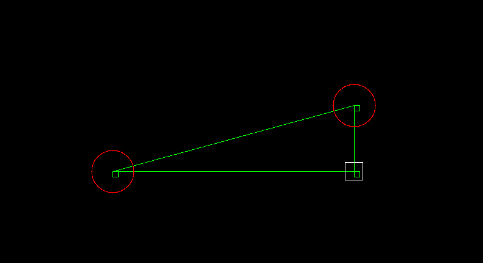

# **lessen en opdrachten van C-les**

one of the programs made is interactive triangle, made with SDL2 in C-Lang, the program makes the user interact with a triangle, the program calculates the angle digrees and them to the user in the terminal.
